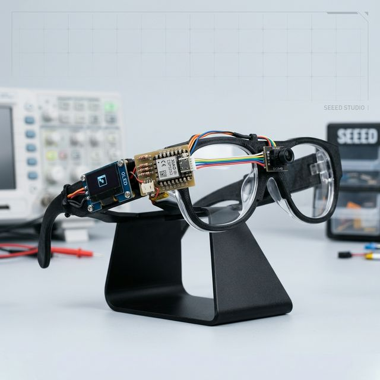
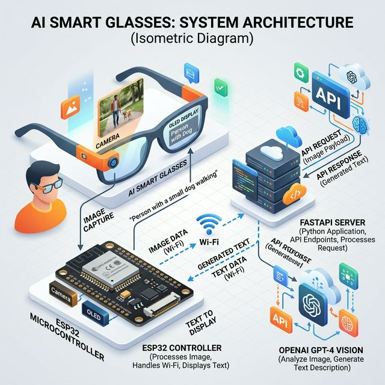
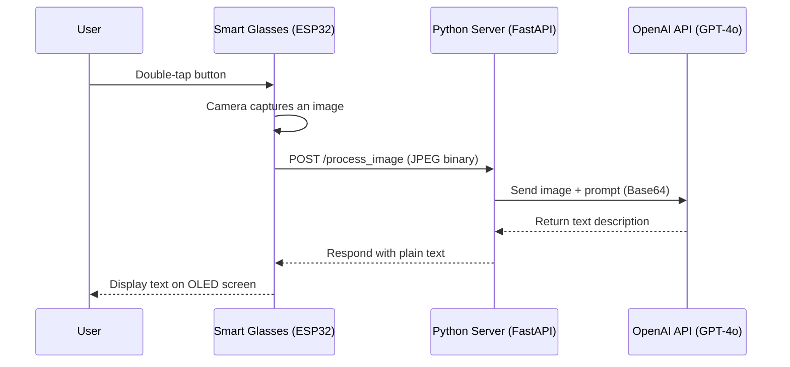

<div align="center">
  <h1>👓 DIY AI Smart Glasses</h1>
  <p><i>Turn any glasses into smart glasses powered by GPT-4o Vision & ESP32</i></p>

  
</div>

## 📌 Overview

This project provides the complete source code and guides to build your own **AI-powered Smart Glasses**. Using an incredibly small ESP32 microcontroller with an attached camera and OLED display, the glasses can capture your point of view and describe what it sees or answer visual questions using OpenAI's powerful GPT-4o Vision API.

### Features
- **One-Click Vision:** Capture an image with the press of a physical button.
- **AI-Powered:** Uses OpenAI's state-of-the-art GPT-4o Vision model to analyze what you're looking at.
- **On-Device Display:** Tiny 0.96" OLED screen returns text directly to your eye line.
- **Local Relay Server:** Fast Python backend server handles the heavy lifting and API key security.

---

## 🏗️ System Architecture

The project is split into two main components:
1. **Arduino Firmware (`firmware/smart_glasses/smart_glasses.ino`)** - Runs on the ESP32. Handles hardware interactions (camera, button, OLED) and network requests.
2. **Python Backend (`backend/server.py`)** - A FastAPI application running on your computer that receives images from the ESP32, queries OpenAI, and sends the AI's response back to the ESP32.

<div align="center">
  
</div>

### Data Flow



---

## 🛠️ 1. Setting up the Smart Glasses (Hardware & Firmware)

### Hardware Requirements & Wiring

You will need the following components:
- **Seeed Studio XIAO ESP32S3 Sense** (includes the OV2640 camera module).
- **0.96 inch SSD1306 OLED Display** (I2C).
- **Push Button / Tactile Switch**.
- Jumper wires and a breadboard or custom 3D printed frame.

| Component | Pin / Connection | XIAO ESP32S3 Pin |
| :--- | :--- | :--- |
| **OLED Display** | SDA | D4 / GPIO 5 |
| | SCL | D5 / GPIO 6 |
| | VCC | 3.3V |
| | GND | GND |
| **Push Button** | Leg 1 | D1 / GPIO 2 |
| | Leg 2 | GND |

> **Note:** The button uses the ESP32's internal pull-up resistor, so no external resistor is needed.

### Software Setup & Flashing

1. Open the project firmware in the standard [Arduino IDE](https://www.arduino.cc/en/software).
2. Install the necessary libraries from the Arduino Library Manager:
   - `Adafruit GFX Library`
   - `Adafruit SSD1306`
3. Install the **esp32** boards manager package by Espressif. 
4. Select **"XIAO_ESP32S3"** as your board.
5. **Critically Important:** Under the Tools menu, enable PSRAM by setting it to `OPI PSRAM` (the camera requires PSRAM to function).
6. **Credential Setup:**
   - Open `firmware/smart_glasses/smart_glasses.ino`.
   - Update `ssid` and `password` to your Wi-Fi credentials.
   - Update `serverUrl` to point to your computer's local IP address (e.g., `http://192.168.1.50:8000/process_image`).
7. Connect the XIAO to your computer via USB-C and click **Upload**.

---

## 💻 2. Setting up the Relay Server (Python Backend)

We use FastAPI and the official OpenAI Python package to safely keep your API key off the device.

### Installation

1. Open a terminal and navigate to the `backend/` directory.
2. *(Highly Recommended)* Create and activate a virtual environment:
   ```bash
   python -m venv venv
   # On Windows:
   venv\Scripts\activate
   # On macOS/Linux:
   source venv/bin/activate
   ```
3. Install dependencies:
   ```bash
   pip install -r requirements.txt
   ```
4. **API Key Setup:**
   - Open `backend/server.py`.
   - Find the `OPENAI_API_KEY` variable and replace it with your actual OpenAI secret key (or set it as an environment variable).

### Running the Server

Start the fast API server directly using Python:
```bash
python server.py
```
*Note: Make sure your ESP32 and Computer are connected to the exact same Wi-Fi network so they can communicate locally.*

---

## 🚀 How to Use

1. **Power On:** Turn on the ESP32 (via battery or USB). It will display a "Booting/Wi-Fi connection" status on the OLED screen.
2. **Ready State:** Once connected, the OLED will show: *"Ready! Double Tap to snap."*
3. **Capture:** Double-tap the push button. 
4. **Processing:** The OLED will indicate that it is processing. The ESP32 captures an image, posts it to your local server, which then queries GPT-4o Vision.
5. **View Result:** After a few seconds, the OLED displays the synthesized text directly to you!

---

<div align="center">
  <p>Built with ❤️ and AI.</p>
</div>
